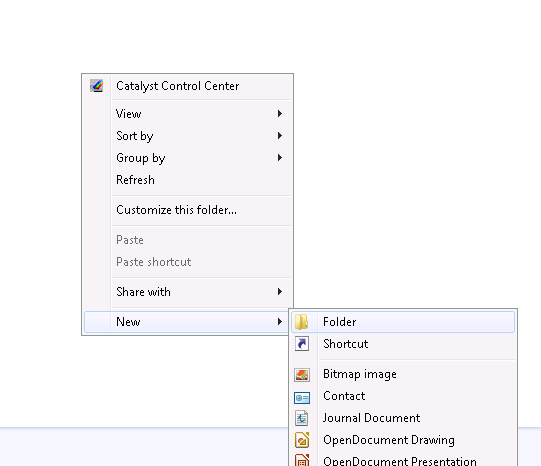
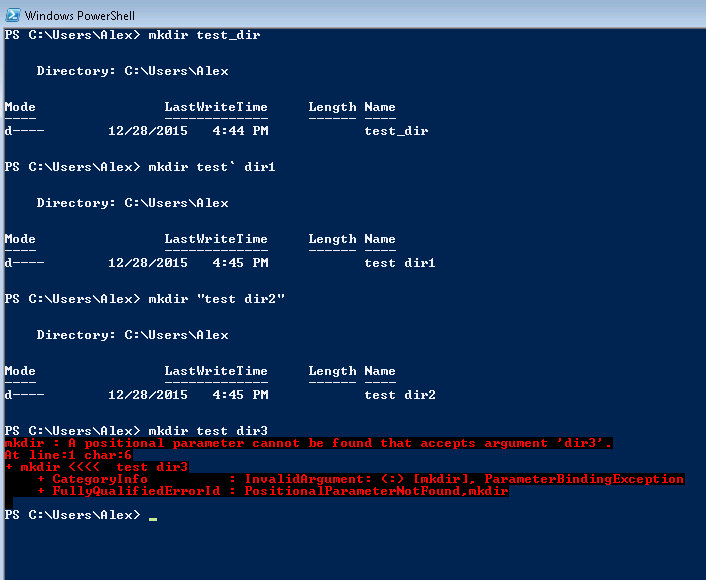
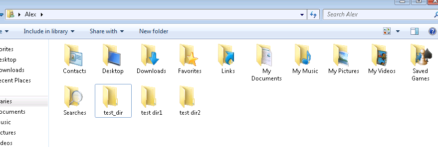
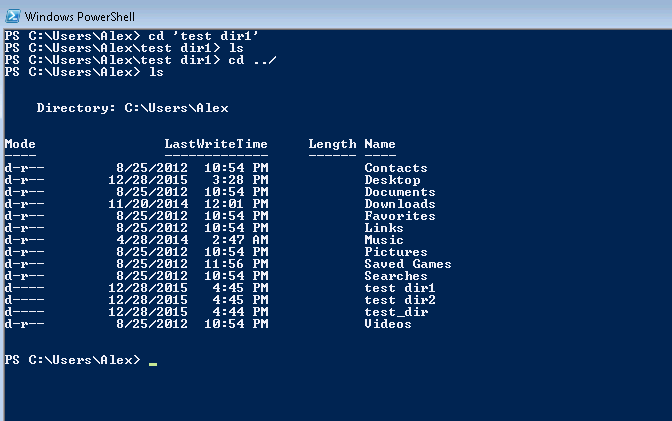

## Listing directory contents

Windows Explorer shows path to a directory at the top of the window and the contents of the directory in the main area. To show the same content in shell, use command `dir`.

At this point we're going to close Command Prompt as Windows Shell was designed to supersede it, having better features such as more shell commands, command auto-completion and generally being a lot less annoying.

There's an alternative command for `dir`, which is `ls` or short for *list*, the difference is mostly historical one, `dir` being mostly used by windows predecessor -- [CP/M](http://discordia.org.uk/px4/cpm.html) in the 1970s, and `ls` first used in Unix, but traces its roots to `listf` available on [Massachusetts Institute of Technology's Compatible Time Sharing System](http://www.tldp.org/LDP/LG/issue48/fischer.html) in July 1961.

Power Shell supports both commands.

## Creating Directories

Creating directories in Windows Explorer -- Right click; New -> Folder

Creating directories in command line is just as easy with `mkdir` except for one caveat -- Power Shell or any shell uses space to separate different command line parameters, so if you want to have a directory name with spaces in it, you need to either quote the whole statement, or add an escape tick in power shell or backslash in Unix before using space symbol.

For example the following commands work

     mkdir test_dir
     mkdir test` dir1
     mkdir "test dir2"

And the command below -- doesn't.

    mkdir test dir3

There's an unescaped space which syntactically means the same thing as a list of two parameters, and Power Shell doesn't know how to deal with that.

There is nothing special about the directories we created and they show as regular directories in Windows Explorer.

## Changing the directories

Change directory (cd) move between different directories, same as double click in Windows Explorer, and much like `mkdir` the command treats spaces in file name much the same way.

    cd 'test dir1'

List the content -- it is empty

    ls

For historical reasons '.' signifies current directory, '..' signify a parent directory. So to go up one level we use the following command --

    cd ..

Listing directories again

    ls

# Exercises

* From windows explorer navigate to your desktop directory, create a subdirectory *shell_tutorial* get into that directory.
* Create directory *test dir*.
* Navigate to *shell_tutorial* using Windows Explorer; Delete directory *test dir* using Windows Explorer

|Previous|Next|
|--------|----|
|[Filesystem Nagivation](0002_filesystem_navigation.md)|[Files](0004_files.md)|